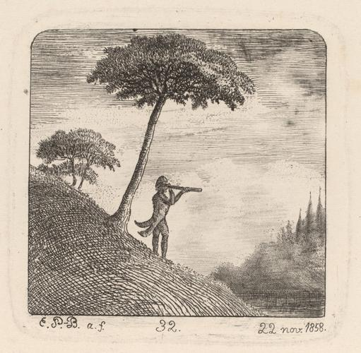

<html>

# Le corbeau, la gazelle, la tortue et le rat (The Crow, the Gazelle, the Tortoise, and
published 1759

Rights: © Courtesy National Gallery of Art, Washington

## Project Description
In this project, I'm creating an artwork rotation system where a new artwork will be displayed every 3 days. Each piece of art represents a unique perspective, theme, or style, adding variety and visual appeal to any space. Through this project, I aim to explore the intersection of art and technology, showcasing the beauty of different artistic creations while leveraging programming to automate the rotation process.

## About Me
Vincent, Nice to meet you! I'm a software engineer with a passion for creating and building things.
Actually working for a company named [GRAUW.](https://grauw.fr), I have experience in web development, mobile development ans scrapping.

## Contact
Feel free to reach out to me via email:
[hellocanardev@gmail.com](mailto:hellocanardev@gmail.com)

</html>
