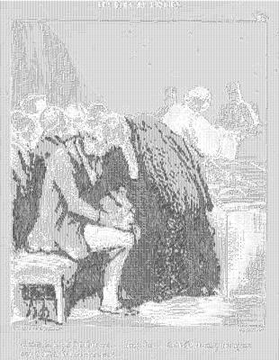

<html>

# Hi, I'm Vincent 👋

I'm a software sorcerer with a knack for conjuring up cool stuff.
Currently spellbinding folks at [GRAUW.](https://grauw.fr), I'm well-versed in web development, mobile sorcery, and even
a bit of data spelunking.
___

 

## Gothic Ornament with a Lady and a Parrot

### Artwork Details

- Date: ca. 1495
- Category: Drawing, Collage or other Work on Paper
- Medium: Pen and brown ink over black chalk
- Image rights: Courtesy National Gallery of Art, Washington
Additional details about the artwork can be found [here](https://www.artsy.net/artwork/master-lcz-gothic-ornament-with-a-lady-and-a-parrot).

### Project Description

In this project, I'm creating an artwork rotation system where a new artwork will be displayed every 3 days. Each piece
of art represents a unique perspective, theme, or style, adding variety and visual appeal to any space. In addition, I
duplicate the picture in ASCII mode, infusing a digital twist into the artistic rotation system. Through this project, I
aim to explore the intersection of art and technology, showcasing the beauty of different artistic creations while
leveraging programming to automate the rotation process.

 

___

## Contact

Got questions, compliments, or just wanna chat about the latest tech trends? Shoot me an email
at [hellocanardev@gmail.com](mailto:hellocanardev@gmail.com). I promise not to hit you with any spam—just good vibes and
maybe a few lines of code.

</html>
