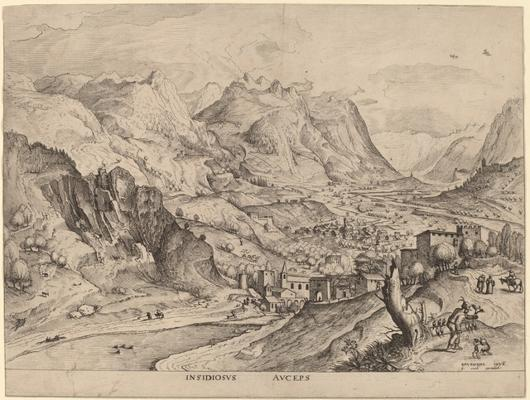
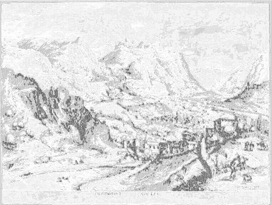

<html>

 

# Insidiosus Auceps (The Crafty Bird-Catcher)

## Artwork Details

- Date: ca. 1555/1557
- Category: Print
- Medium: Etching and engraving
- Image rights: Courtesy National Gallery of Art, Washington

Additional details about the artwork can be found [here](https://www.artsy.net/artwork/johannes-and-lucas-van-doetechum-after-pieter-bruegel-the-elder-insidiosus-auceps-the-crafty-bird-catcher).

## Contact

Got questions, compliments, or just wanna chat about the latest tech trends? Shoot me an email
at [hellocanardev@gmail.com](mailto:hellocanardev@gmail.com). I promise not to hit you with any spam—just good vibes and
maybe a few lines of code.

</html>
