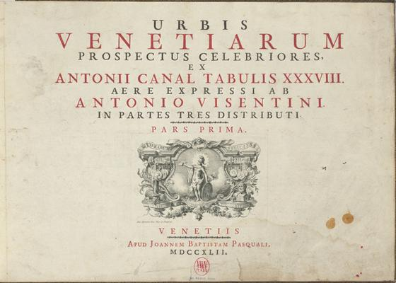
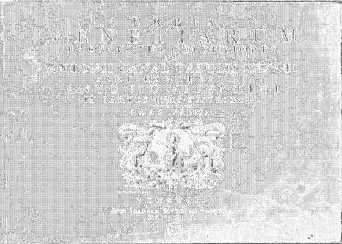

<html>

    
    

# Urbis Venetiarum Prospectus Celebriores, Ex Antonii Canal Tabulis XXXVIII. Aere Expressi ab Antonio Visentini in Partes Tres Distributi. Pars Prima [-Pars Tertia]

## Artwork Details

- Date: published 1742
- Category: Other
- Medium: 3 parts in 1 vol: ill: etched portaits of canaletto and visentini plus 38 etchings (all full-page, versos blank) by visentini
- Image rights: Courtesy National Gallery of Art, Washington

Additional details about the artwork can be found [here](https://www.artsy.net/artwork/antonio-visentini-author-urbis-venetiarum-prospectus-celebriores-ex-antonii-canal-tabulis-xxxviii-aere-expressi-ab-antonio-visentini-in-partes-tres-distributi-pars-prima-pars-tertia).

## Contact

Got questions, compliments, or just wanna chat about the latest tech trends? Shoot me an email
at [hellocanardev@gmail.com](mailto:hellocanardev@gmail.com). I promise not to hit you with any spam—just good vibes and
maybe a few lines of code.

</html>
