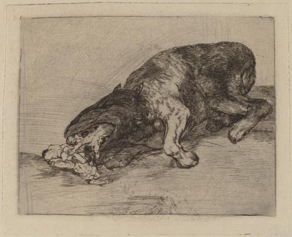
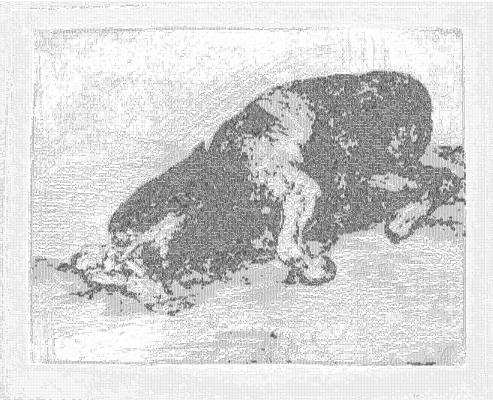

<html>

    
    

# Fiero monstruo! (Fierce Monster!)

## Artwork Details

- Date: 1810/1820
- Category: Print
- Medium: Etching, drypoint and burin [trial proof printed posthumously calcografia in or after 1870]
- Image rights: Courtesy National Gallery of Art, Washington

Additional details about the artwork can be found [here](https://www.artsy.net/artwork/francisco-de-goya-fiero-monstruo-fierce-monster-1).

## Contact

Got questions, compliments, or just wanna chat about the latest tech trends? Shoot me an email
at [hellocanardev@gmail.com](mailto:hellocanardev@gmail.com). I promise not to hit you with any spam—just good vibes and
maybe a few lines of code.

</html>
