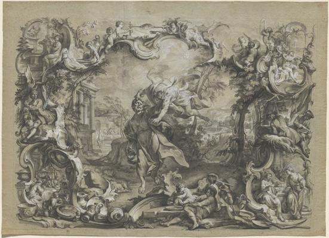
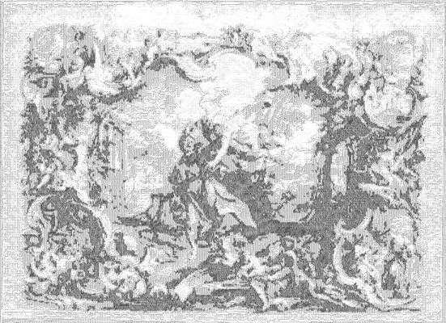

<html>

    
    

# The Angel Carrying off Habakkuk by His Hair, Surrounded by an Elaborate Rococo Frame

## Artwork Details

- Date: ca. 1750
- Category: Drawing, Collage or other Work on Paper
- Medium: Pen and black ink with gray wash over graphite, heightened with white and incised throughout, on two joined sheets of blue laid paper, verso reddened for transfer
- Image rights: Courtesy National Gallery of Art, Washington

Additional details about the artwork can be found [here](https://www.artsy.net/artwork/johann-wolfgang-baumgartner-the-angel-carrying-off-habakkuk-by-his-hair-surrounded-by-an-elaborate-rococo-frame).

## Contact

Got questions, compliments, or just wanna chat about the latest tech trends? Shoot me an email
at [hellocanardev@gmail.com](mailto:hellocanardev@gmail.com). I promise not to hit you with any spam—just good vibes and
maybe a few lines of code.

</html>
