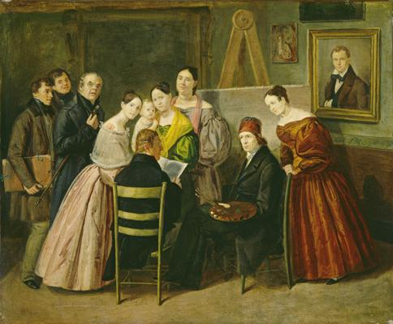
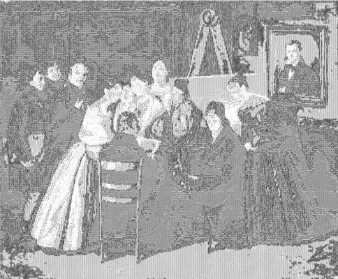

<html>

    
    

# A Painter and Visitors in a Studio

## Artwork Details

- Date: ca. 1835
- Category: Painting
- Medium: Oil on paper on canvas
- Image rights: Courtesy National Gallery of Art, Washington

Additional details about the artwork can be found [here](https://www.artsy.net/artwork/unknown-19th-century-a-painter-and-visitors-in-a-studio).

## Contact

Got questions, compliments, or just wanna chat about the latest tech trends? Shoot me an email
at [hellocanardev@gmail.com](mailto:hellocanardev@gmail.com). I promise not to hit you with any spam—just good vibes and
maybe a few lines of code.

</html>
