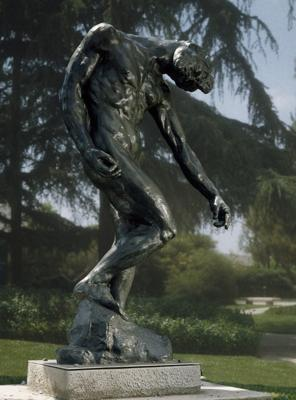
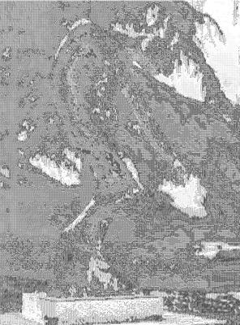

<html>

    
    

# The Shade

## Artwork Details

- Date: first modeled ca. 1880, enlarged ca. 1901, this cast 1969
- Category: Sculpture
- Medium: Bronze
- Image rights: Image provided by the Los Angeles County Museum of Art

Additional details about the artwork can be found [here](https://www.artsy.net/artwork/auguste-rodin-the-shade).

## Contact

Got questions, compliments, or just wanna chat about the latest tech trends? Shoot me an email
at [hellocanardev@gmail.com](mailto:hellocanardev@gmail.com). I promise not to hit you with any spam—just good vibes and
maybe a few lines of code.

</html>
