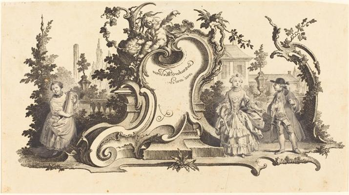
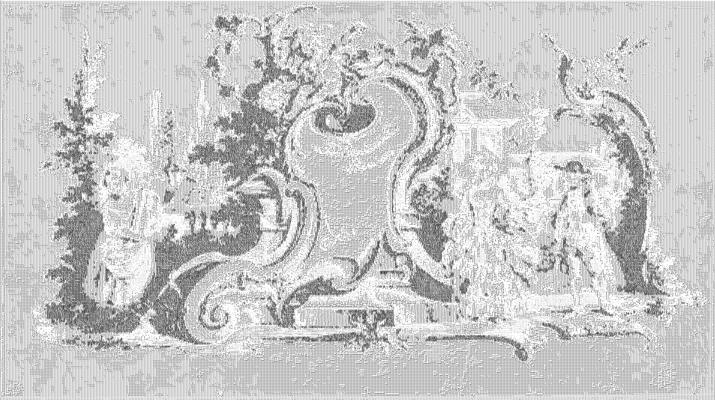

<html>

    
    

# Cartouches Modernes orné avec des [diferentes Figures] (Plate VI-1 from the set)

## Artwork Details

- Date: Unknown
- Category: Print
- Medium: Counterproof of an etching with drawing in pen and black ink and gray wash, on laid paper incised with grounding in red chalk for transfer on verso
- Image rights: Courtesy National Gallery of Art, Washington

Additional details about the artwork can be found [here](https://www.artsy.net/artwork/johann-esaias-nilson-cartouches-modernes-orne-avec-des-diferentes-figures-plate-vi-1-from-the-set).

## Contact

Got questions, compliments, or just wanna chat about the latest tech trends? Shoot me an email
at [hellocanardev@gmail.com](mailto:hellocanardev@gmail.com). I promise not to hit you with any spam—just good vibes and
maybe a few lines of code.

</html>
