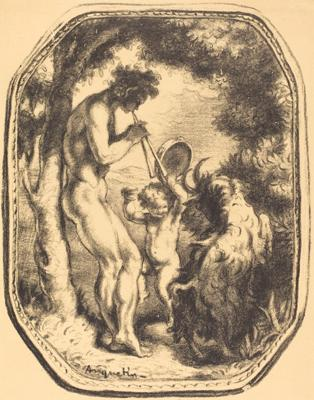
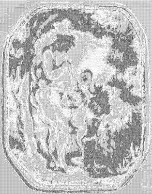

<html>

    
    

# Le Talion; La Cage; Ceux qui restent; Fortune

## Artwork Details

- Date: 1898
- Category: Print
- Medium: Lithograph in black on wove paper [proof before letters]
- Image rights: Courtesy National Gallery of Art, Washington

Additional details about the artwork can be found [here](https://www.artsy.net/artwork/louis-anquetin-le-talion-la-cage-ceux-qui-restent-fortune).

## Contact

Got questions, compliments, or just wanna chat about the latest tech trends? Shoot me an email
at [hellocanardev@gmail.com](mailto:hellocanardev@gmail.com). I promise not to hit you with any spam—just good vibes and
maybe a few lines of code.

</html>
