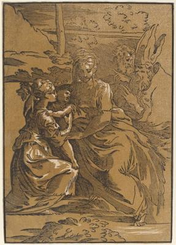
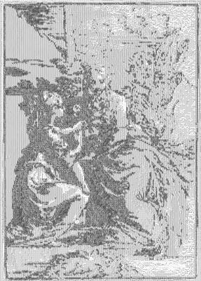

<html>

    
    

# The Holy Family with Two Saints

## Artwork Details

- Date: Unknown
- Category: Print
- Medium: Chiaroscuro woodcut printed from two blocks: black line block and yellow-brown tone block
- Image rights: Courtesy National Gallery of Art, Washington

Additional details about the artwork can be found [here](https://www.artsy.net/artwork/antonio-da-trento-after-parmigianino-the-holy-family-with-two-saints-1).

## Contact

Got questions, compliments, or just wanna chat about the latest tech trends? Shoot me an email
at [hellocanardev@gmail.com](mailto:hellocanardev@gmail.com). I promise not to hit you with any spam—just good vibes and
maybe a few lines of code.

</html>
