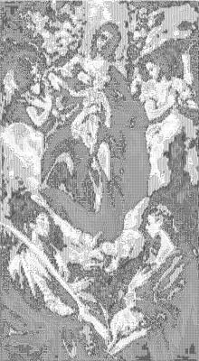

<html>

    
    

# Madonna and Child with Saint Martina and Saint Agnes

## Artwork Details

- Date: 1597/1599
- Category: Painting
- Medium: Oil on canvas, wooden strip added at bottom
- Image rights: Courtesy National Gallery of Art, Washington

Additional details about the artwork can be found [here](https://www.artsy.net/artwork/el-greco-madonna-and-child-with-saint-martina-and-saint-agnes).

## Contact

Got questions, compliments, or just wanna chat about the latest tech trends? Shoot me an email
at [hellocanardev@gmail.com](mailto:hellocanardev@gmail.com). I promise not to hit you with any spam—just good vibes and
maybe a few lines of code.

</html>
