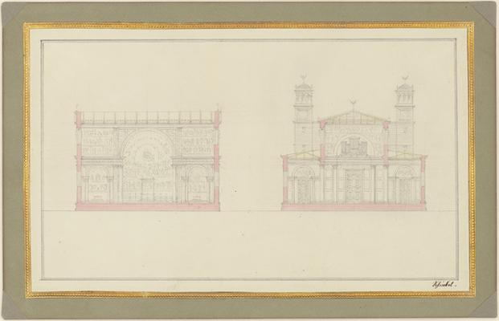
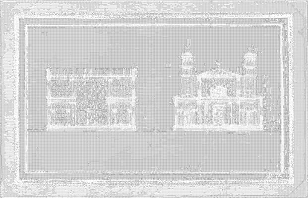

<html>

    
    

# Section of the Crossing and the West End of a Cathedral for Berlin

## Artwork Details

- Date: 1827
- Category: Drawing, Collage or other Work on Paper
- Medium: Graphite and watercolor on wove paper, laid down on presentation mount
- Image rights: Courtesy National Gallery of Art, Washington

Additional details about the artwork can be found [here](https://www.artsy.net/artwork/karl-friedrich-schinkel-section-of-the-crossing-and-the-west-end-of-a-cathedral-for-berlin).

## Contact

Got questions, compliments, or just wanna chat about the latest tech trends? Shoot me an email
at [hellocanardev@gmail.com](mailto:hellocanardev@gmail.com). I promise not to hit you with any spam—just good vibes and
maybe a few lines of code.

</html>
