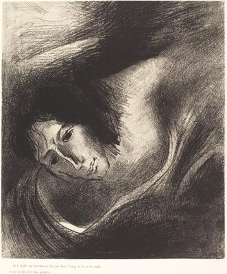
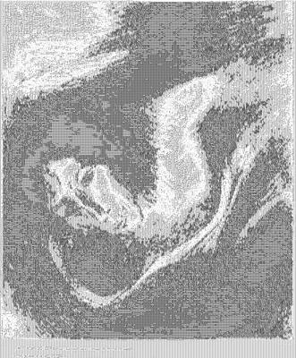

<html>

    
    

# Et le diable qui les seduisait, fut jete dans l'etang de feu et de soufre, ou es la b ete et le faux prophete (And the devil thatdeceived them was cast into the lake of fire and  brimstone, where the beast and the false prophet are)

## Artwork Details

- Date: 1899
- Category: Print
- Medium: Lithograph
- Image rights: Courtesy National Gallery of Art, Washington

Additional details about the artwork can be found [here](https://www.artsy.net/artwork/odilon-redon-et-le-diable-qui-les-seduisait-fut-jete-dans-letang-de-feu-et-de-soufre-ou-es-la-b-ete-et-le-faux-prophete-and-the-devil-thatdeceived-them-was-cast-into-the-lake-of-fire-and-brimstone-where-the-beast-and-the-false-prophet-are).

## Contact

Got questions, compliments, or just wanna chat about the latest tech trends? Shoot me an email
at [hellocanardev@gmail.com](mailto:hellocanardev@gmail.com). I promise not to hit you with any spam—just good vibes and
maybe a few lines of code.

</html>
