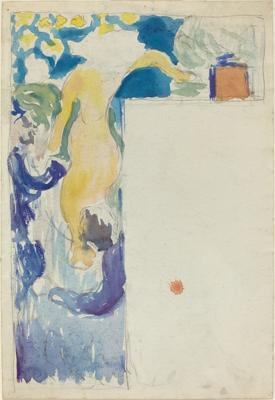
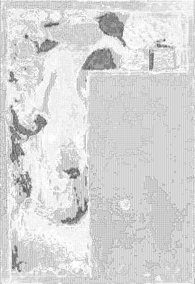

<html>

    
    

# Program Design for the Théâtre Libre [recto]

## Artwork Details

- Date: ca. 1890
- Category: Drawing, Collage or other Work on Paper
- Medium: Watercolor over graphite on wove paper
- Image rights: Courtesy National Gallery of Art, Washington

Additional details about the artwork can be found [here](https://www.artsy.net/artwork/edouard-vuillard-program-design-for-the-theatre-libre-recto).

## Contact

Got questions, compliments, or just wanna chat about the latest tech trends? Shoot me an email
at [hellocanardev@gmail.com](mailto:hellocanardev@gmail.com). I promise not to hit you with any spam—just good vibes and
maybe a few lines of code.

</html>
