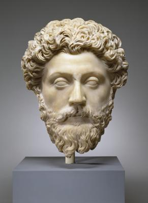
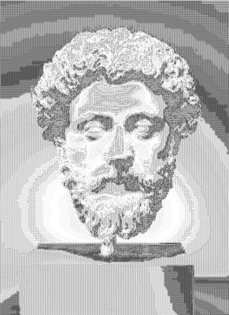

<html>

    
    

# Portrait of the Emperor Marcus Aurelius

## Artwork Details

- Date: 161-180
- Category: Sculpture
- Medium: Marble
- Image rights: Image Provided by The Walters Art Museum

Additional details about the artwork can be found [here](https://www.artsy.net/artwork/portrait-of-the-emperor-marcus-aurelius).

## Contact

Got questions, compliments, or just wanna chat about the latest tech trends? Shoot me an email
at [hellocanardev@gmail.com](mailto:hellocanardev@gmail.com). I promise not to hit you with any spam—just good vibes and
maybe a few lines of code.

</html>
