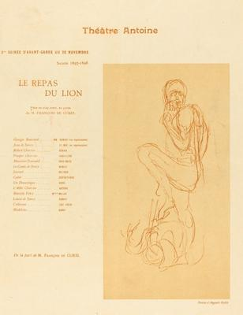
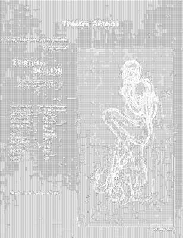

<html>

    
    

# Le Repas du lion

## Artwork Details

- Date: 1897
- Category: Print
- Medium: Collotype in red on wove paper
- Image rights: Courtesy National Gallery of Art, Washington

Additional details about the artwork can be found [here](https://www.artsy.net/artwork/after-auguste-rodin-le-repas-du-lion-1).

## Contact

Got questions, compliments, or just wanna chat about the latest tech trends? Shoot me an email
at [hellocanardev@gmail.com](mailto:hellocanardev@gmail.com). I promise not to hit you with any spam—just good vibes and
maybe a few lines of code.

</html>
