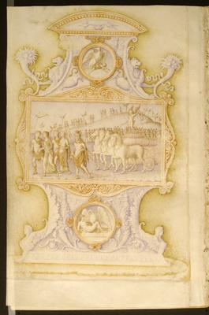
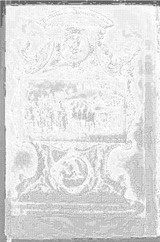

<html>

    
    

# The Triumph of Love 

## Artwork Details

- Date: ca. 1480
- Category: Drawing, Collage or other Work on Paper
- Medium: Ink and paint on parchment
- Image rights: Image Provided by The Walters Art Museum

Additional details about the artwork can be found [here](https://www.artsy.net/artwork/bartolomeo-sanvito-the-triumph-of-love).

## Contact

Got questions, compliments, or just wanna chat about the latest tech trends? Shoot me an email
at [hellocanardev@gmail.com](mailto:hellocanardev@gmail.com). I promise not to hit you with any spam—just good vibes and
maybe a few lines of code.

</html>
