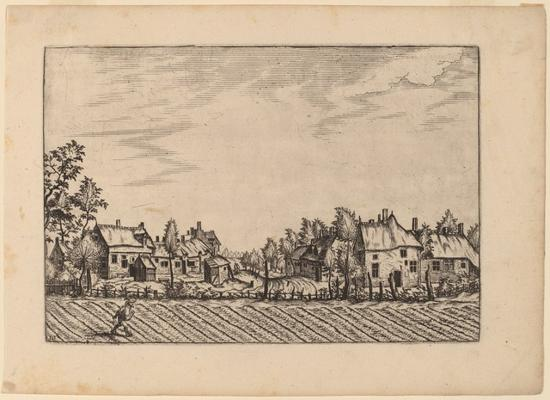
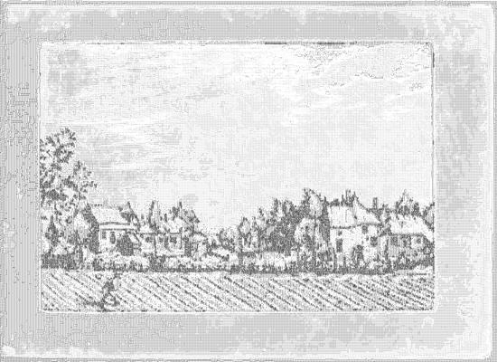

<html>

    
    

# Farms

## Artwork Details

- Date: in or before 1676
- Category: Print
- Medium: Etching retouched with engraving
- Image rights: Courtesy National Gallery of Art, Washington

Additional details about the artwork can be found [here](https://www.artsy.net/artwork/johannes-van-doetechum-the-elder-and-lucas-van-doetechum-after-master-of-the-small-landscapes-farms-2).

## Contact

Got questions, compliments, or just wanna chat about the latest tech trends? Shoot me an email
at [hellocanardev@gmail.com](mailto:hellocanardev@gmail.com). I promise not to hit you with any spam—just good vibes and
maybe a few lines of code.

</html>
