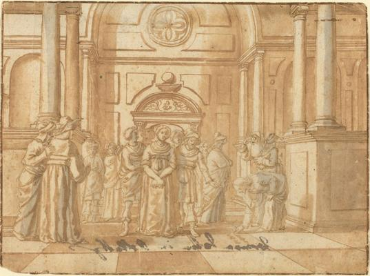
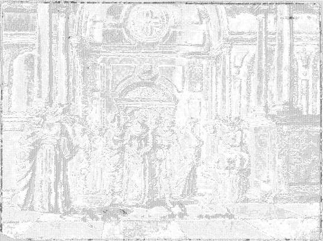

<html>

    
    

# Christ and the Woman Taken in Adultery

## Artwork Details

- Date: 16th century
- Category: Drawing, Collage or other Work on Paper
- Medium: Pen and brown ink with brown and gray wash on laidpaper
- Image rights: Courtesy National Gallery of Art, Washington

Additional details about the artwork can be found [here](https://www.artsy.net/artwork/netherlandish-16th-century-christ-and-the-woman-taken-in-adultery).

## Contact

Got questions, compliments, or just wanna chat about the latest tech trends? Shoot me an email
at [hellocanardev@gmail.com](mailto:hellocanardev@gmail.com). I promise not to hit you with any spam—just good vibes and
maybe a few lines of code.

</html>
