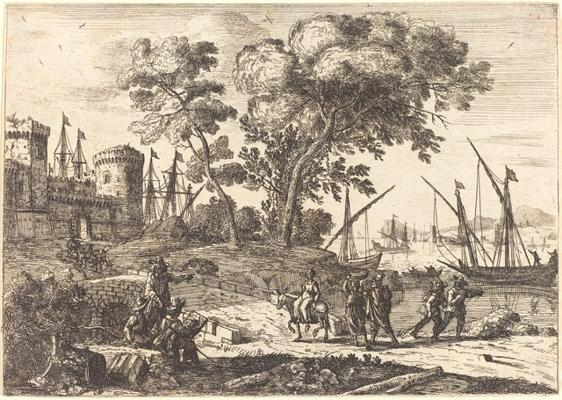
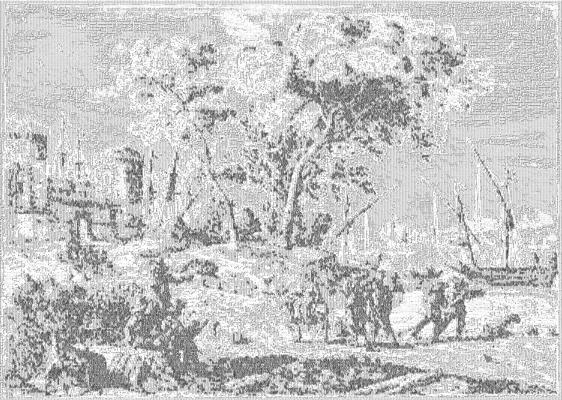

<html>

    
    

# Coast Scene with an Artist (Le dessinateur)

## Artwork Details

- Date: ca. 1638/1641
- Category: Print
- Medium: Etching
- Image rights: Courtesy National Gallery of Art, Washington

Additional details about the artwork can be found [here](https://www.artsy.net/artwork/claude-lorrain-coast-scene-with-an-artist-le-dessinateur).

## Contact

Got questions, compliments, or just wanna chat about the latest tech trends? Shoot me an email
at [hellocanardev@gmail.com](mailto:hellocanardev@gmail.com). I promise not to hit you with any spam—just good vibes and
maybe a few lines of code.

</html>
