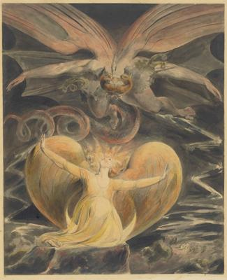
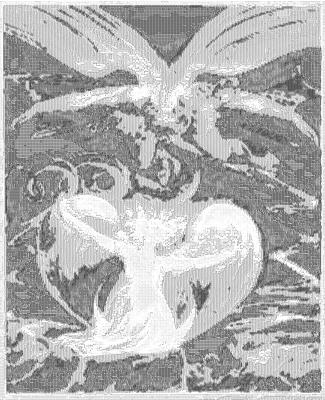

<html>

    
    

# The Great Red Dragon and the Woman Clothed with the Sun

## Artwork Details

- Date: 1805
- Category: Drawing, Collage or other Work on Paper
- Medium: Pen and ink with watercolor over graphite
- Image rights: Courtesy National Gallery of Art, Washington

Additional details about the artwork can be found [here](https://www.artsy.net/artwork/william-blake-1757-1827-the-great-red-dragon-and-the-woman-clothed-with-the-sun).

## Contact

Got questions, compliments, or just wanna chat about the latest tech trends? Shoot me an email
at [hellocanardev@gmail.com](mailto:hellocanardev@gmail.com). I promise not to hit you with any spam—just good vibes and
maybe a few lines of code.

</html>
