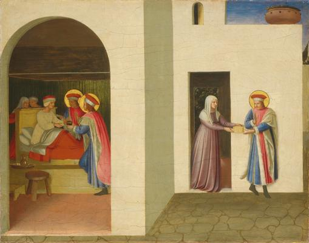
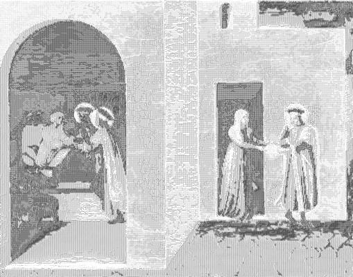

<html>

    
    

# The Healing of Palladia by Saint Cosmas and Saint Damian

## Artwork Details

- Date: ca. 1438/1440
- Category: Painting
- Medium: Tempera (and oil?) on panel
- Image rights: Courtesy National Gallery of Art, Washington

Additional details about the artwork can be found [here](https://www.artsy.net/artwork/fra-angelico-the-healing-of-palladia-by-saint-cosmas-and-saint-damian).

## Contact

Got questions, compliments, or just wanna chat about the latest tech trends? Shoot me an email
at [hellocanardev@gmail.com](mailto:hellocanardev@gmail.com). I promise not to hit you with any spam—just good vibes and
maybe a few lines of code.

</html>
