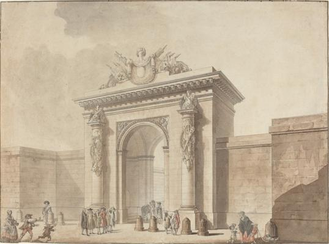
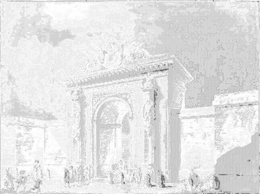

<html>

    
    

# Portal of the Hôtel d'Uzès, rue Montmartre, Paris

## Artwork Details

- Date: 1768 or 1784
- Category: Drawing, Collage or other Work on Paper
- Medium: Pen and black ink with watercolor on laid paper
- Image rights: Courtesy National Gallery of Art, Washington

Additional details about the artwork can be found [here](https://www.artsy.net/artwork/studio-of-claude-nicolas-ledoux-portal-of-the-hotel-duzes-rue-montmartre-paris).

## Contact

Got questions, compliments, or just wanna chat about the latest tech trends? Shoot me an email
at [hellocanardev@gmail.com](mailto:hellocanardev@gmail.com). I promise not to hit you with any spam—just good vibes and
maybe a few lines of code.

</html>
