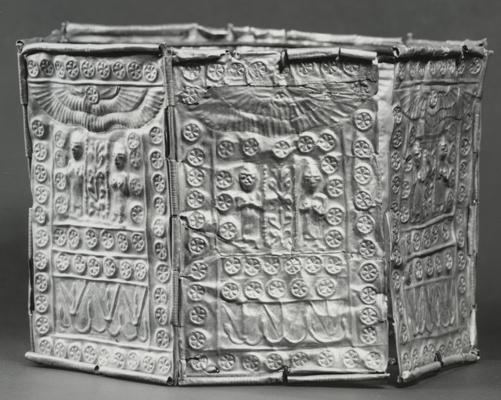
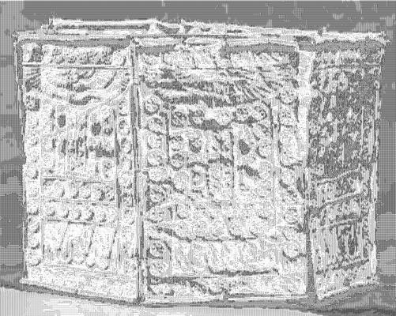

<html>

    
    

# Crown with Goddesses and Floral Elements

## Artwork Details

- Date: 10th-9th century B.C.
- Category: Sculpture
- Medium: Gold
- Image rights: Image provided by the Walters Art Museum

Additional details about the artwork can be found [here](https://www.artsy.net/artwork/crown-with-goddesses-and-floral-elements).

## Contact

Got questions, compliments, or just wanna chat about the latest tech trends? Shoot me an email
at [hellocanardev@gmail.com](mailto:hellocanardev@gmail.com). I promise not to hit you with any spam—just good vibes and
maybe a few lines of code.

</html>
