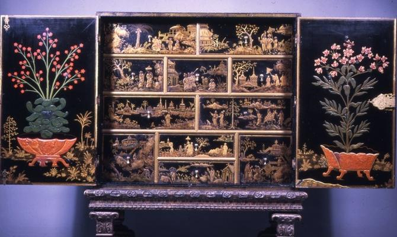

<html>

    
    

# Cabinet with Chinese and American Motifs

## Artwork Details

- Date: 1690-1700
- Category: Design/Decorative Art
- Medium: Wood (pine) with paint and gilt
- Image rights: Image provided by the Walters Art Museum

Additional details about the artwork can be found [here](https://www.artsy.net/artwork/cabinet-with-chinese-and-american-motifs).

## Contact

Got questions, compliments, or just wanna chat about the latest tech trends? Shoot me an email
at [hellocanardev@gmail.com](mailto:hellocanardev@gmail.com). I promise not to hit you with any spam—just good vibes and
maybe a few lines of code.

</html>
