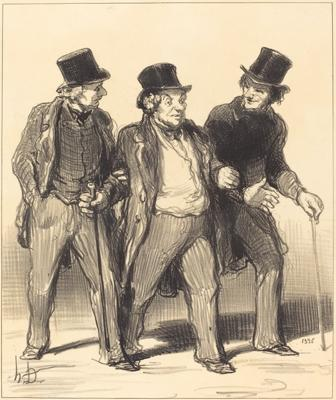
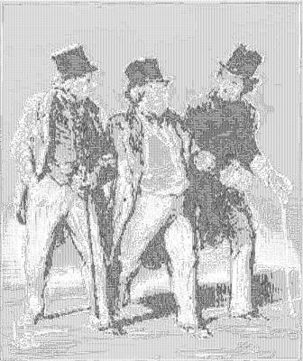

<html>

    
    

# Il me semble que j'aperçois...  un... chien... pas muselé!...

## Artwork Details

- Date: 1852
- Category: Print
- Medium: Lithograph
- Image rights: Courtesy National Gallery of Art, Washington

Additional details about the artwork can be found [here](https://www.artsy.net/artwork/honore-daumier-il-me-semble-que-japercois-dot-dot-dot-un-dot-dot-dot-chien-dot-dot-dot-pas-musele-dot-dot-dot).

## Contact

Got questions, compliments, or just wanna chat about the latest tech trends? Shoot me an email
at [hellocanardev@gmail.com](mailto:hellocanardev@gmail.com). I promise not to hit you with any spam—just good vibes and
maybe a few lines of code.

</html>
