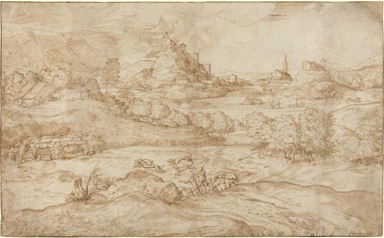
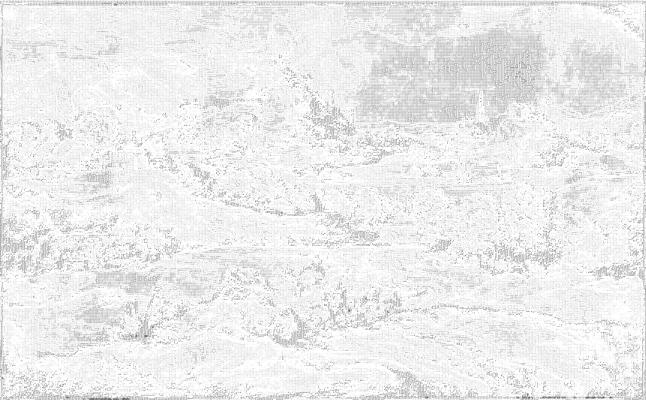

<html>

    
    

# Landscape with Shepherds Driving Away a Wolf

## Artwork Details

- Date: ca. 1540
- Category: Drawing, Collage or other Work on Paper
- Medium: Pen and brown ink with touches of pale green wash on laid paper
- Image rights: Courtesy National Gallery of Art, Washington

Additional details about the artwork can be found [here](https://www.artsy.net/artwork/domenico-campagnola-landscape-with-shepherds-driving-away-a-wolf).

## Contact

Got questions, compliments, or just wanna chat about the latest tech trends? Shoot me an email
at [hellocanardev@gmail.com](mailto:hellocanardev@gmail.com). I promise not to hit you with any spam—just good vibes and
maybe a few lines of code.

</html>
