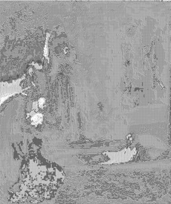

<html>

    
    

# The Raising of Lazarus

## Artwork Details

- Date: ca. 1630-1632
- Category: Painting
- Medium: Oil on wood
- Image rights: Image provided by the Los Angeles County Museum of Art

Additional details about the artwork can be found [here](https://www.artsy.net/artwork/rembrandt-van-rijn-the-raising-of-lazarus).

## Contact

Got questions, compliments, or just wanna chat about the latest tech trends? Shoot me an email
at [hellocanardev@gmail.com](mailto:hellocanardev@gmail.com). I promise not to hit you with any spam—just good vibes and
maybe a few lines of code.

</html>
