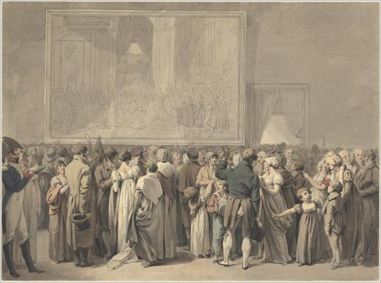
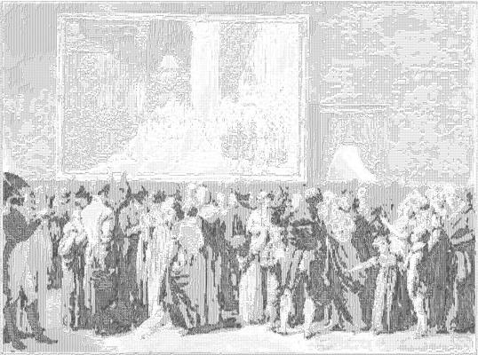

<html>

    
    

# The Public in the Salon of the Louvre, Viewing the Painting of the "Sacre"

## Artwork Details

- Date: begun 1808
- Category: Drawing, Collage or other Work on Paper
- Medium: Pen and black ink with gray wash and watercolor over traces of graphite on laid paper
- Image rights: Courtesy National Gallery of Art, Washington

Additional details about the artwork can be found [here](https://www.artsy.net/artwork/louis-leopold-boilly-the-public-in-the-salon-of-the-louvre-viewing-the-painting-of-the-sacre).

## Contact

Got questions, compliments, or just wanna chat about the latest tech trends? Shoot me an email
at [hellocanardev@gmail.com](mailto:hellocanardev@gmail.com). I promise not to hit you with any spam—just good vibes and
maybe a few lines of code.

</html>
