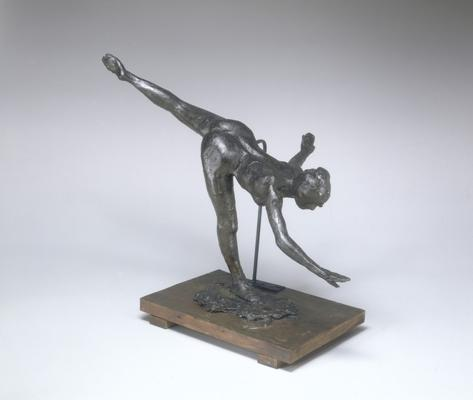
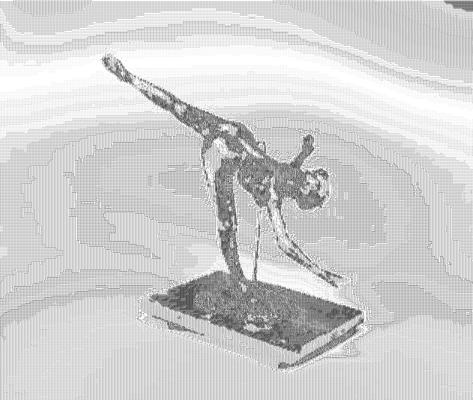

<html>

    
    

# Grande Arabesque, Third Time (First Arabesque Penchée)

## Artwork Details

- Date: ca. 1885/1890
- Category: Sculpture
- Medium: Greenish-brown and black plastiline
- Image rights: Courtesy National Gallery of Art, Washington

Additional details about the artwork can be found [here](https://www.artsy.net/artwork/edgar-degas-grande-arabesque-third-time-first-arabesque-penchee).

## Contact

Got questions, compliments, or just wanna chat about the latest tech trends? Shoot me an email
at [hellocanardev@gmail.com](mailto:hellocanardev@gmail.com). I promise not to hit you with any spam—just good vibes and
maybe a few lines of code.

</html>
