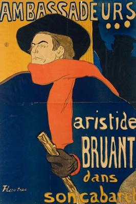
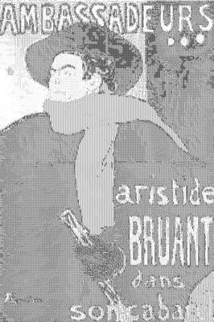

<html>

    
    

# Aristide Bruant, singer and composer, on a poster announcing his performance at the elegant night-club "Les Ambassadeurs" on the Champs Elysées, Paris

## Artwork Details

- Date: 1892
- Category: Posters
- Medium: Lithograph
- Image rights: Source: Wikimedia Commons / Public Domain

Additional details about the artwork can be found [here](https://www.artsy.net/artwork/henri-de-toulouse-lautrec-aristide-bruant-singer-and-composer-on-a-poster-announcing-his-performance-at-the-elegant-night-club-les-ambassadeurs-on-the-champs-elysees-paris).

## Contact

Got questions, compliments, or just wanna chat about the latest tech trends? Shoot me an email
at [hellocanardev@gmail.com](mailto:hellocanardev@gmail.com). I promise not to hit you with any spam—just good vibes and
maybe a few lines of code.

</html>
