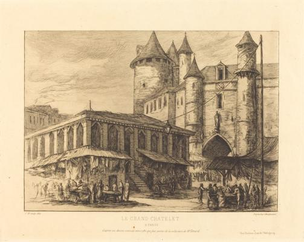
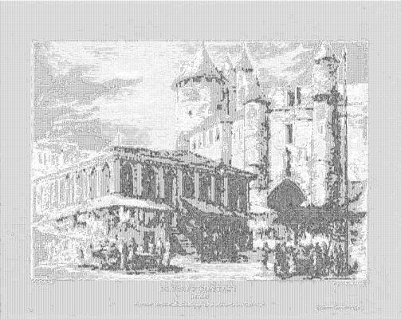

<html>

    
    

# Le Grand Chatelet, Paris, vers 1780 (The Grand Chatelet, Paris, about 1780)

## Artwork Details

- Date: 1861
- Category: Print
- Medium: Etching
- Image rights: Courtesy National Gallery of Art, Washington

Additional details about the artwork can be found [here](https://www.artsy.net/artwork/charles-meryon-le-grand-chatelet-paris-vers-1780-the-grand-chatelet-paris-about-1780).

## Contact

Got questions, compliments, or just wanna chat about the latest tech trends? Shoot me an email
at [hellocanardev@gmail.com](mailto:hellocanardev@gmail.com). I promise not to hit you with any spam—just good vibes and
maybe a few lines of code.

</html>
