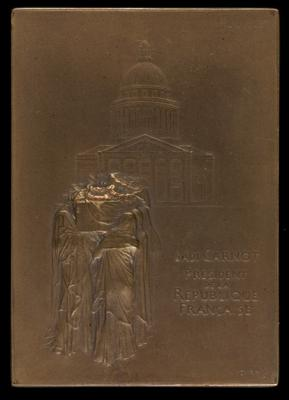
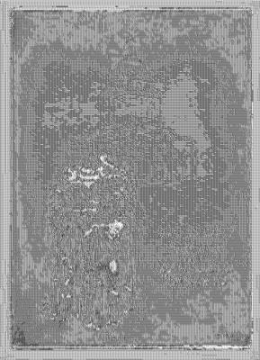

<html>

    
    

# The Body of President Sadi Carnot Borne to the Panthéon [obverse]

## Artwork Details

- Date: 1894
- Category: Sculpture
- Medium: Bronze
- Image rights: Courtesy National Gallery of Art, Washington

Additional details about the artwork can be found [here](https://www.artsy.net/artwork/louis-oscar-roty-the-body-of-president-sadi-carnot-borne-to-the-pantheon-obverse-1).

## Contact

Got questions, compliments, or just wanna chat about the latest tech trends? Shoot me an email
at [hellocanardev@gmail.com](mailto:hellocanardev@gmail.com). I promise not to hit you with any spam—just good vibes and
maybe a few lines of code.

</html>
