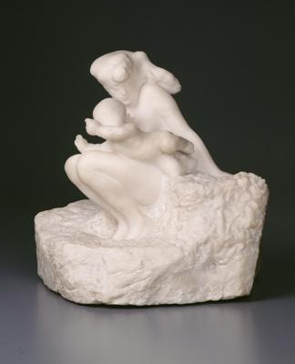
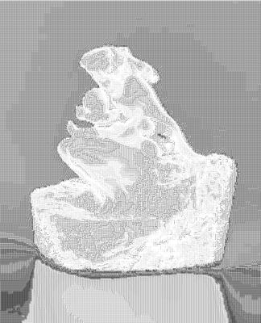

<html>

    
    

# Woman and Child (originally Première Impression d'Amour)

## Artwork Details

- Date: ca. 1885 (model), ca. 1900 (carved), 1901
- Category: Sculpture
- Medium: Marble
- Image rights: Courtesy National Gallery of Art, Washington

Additional details about the artwork can be found [here](https://www.artsy.net/artwork/auguste-rodin-woman-and-child-originally-premiere-impression-damour).

## Contact

Got questions, compliments, or just wanna chat about the latest tech trends? Shoot me an email
at [hellocanardev@gmail.com](mailto:hellocanardev@gmail.com). I promise not to hit you with any spam—just good vibes and
maybe a few lines of code.

</html>
