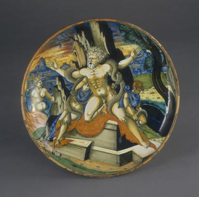
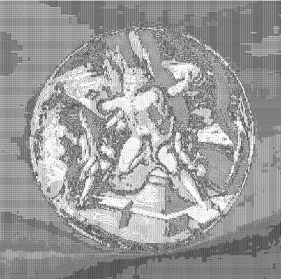

<html>

    
    

# Shallow bowl on low foot with the death of Laocoön and his two sons

## Artwork Details

- Date: 1539
- Category: Design/Decorative Art
- Medium: Tin-glazed earthenware (maiolica)
- Image rights: Courtesy National Gallery of Art, Washington

Additional details about the artwork can be found [here](https://www.artsy.net/artwork/attributed-to-francesco-xanto-avelli-urbino-possibly-with-assistants-lustered-in-the-workshop-of-maestro-giorgio-andreoli-of-gubbio-or-possibly-in-urbino-shallow-bowl-on-low-foot-with-the-death-of-laocoon-and-his-two-sons).

## Contact

Got questions, compliments, or just wanna chat about the latest tech trends? Shoot me an email
at [hellocanardev@gmail.com](mailto:hellocanardev@gmail.com). I promise not to hit you with any spam—just good vibes and
maybe a few lines of code.

</html>
