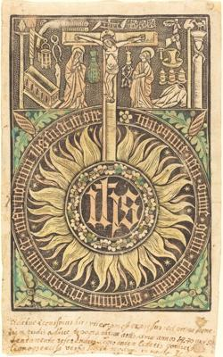
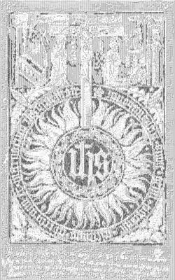

<html>

    
    

# The Sacred Monograph with the Crucifixion  and Passion Symbols [recto]

## Artwork Details

- Date: in or after 1470
- Category: Print
- Medium: Metalcut, hand-colored in light green, rose, and yellow
- Image rights: Courtesy National Gallery of Art, Washington

Additional details about the artwork can be found [here](https://www.artsy.net/artwork/german-15th-century-the-sacred-monograph-with-the-crucifixion-and-passion-symbols-recto).

## Contact

Got questions, compliments, or just wanna chat about the latest tech trends? Shoot me an email
at [hellocanardev@gmail.com](mailto:hellocanardev@gmail.com). I promise not to hit you with any spam—just good vibes and
maybe a few lines of code.

</html>
