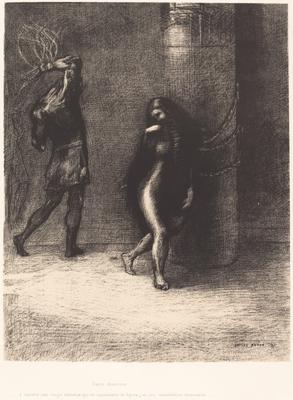
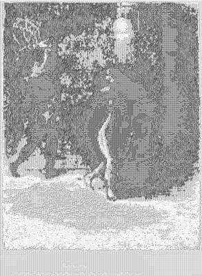

<html>

    
    

# Saint-Antoine...A travers ses longs cheveux qui lui couvraient la figure, j'ai cru reconnaitre Ammonaria (Saint Anthony: "Beneathe her long hair , which covered her face, I thought I recognized Ammonaria)

## Artwork Details

- Date: 1889
- Category: Print
- Medium: Lithograph
- Image rights: Courtesy National Gallery of Art, Washington

Additional details about the artwork can be found [here](https://www.artsy.net/artwork/odilon-redon-saint-antoine-dot-dot-dot-a-travers-ses-longs-cheveux-qui-lui-couvraient-la-figure-jai-cru-reconnaitre-ammonaria-saint-anthony-beneathe-her-long-hair-which-covered-her-face-i-thought-i-recognized-ammonaria).

## Contact

Got questions, compliments, or just wanna chat about the latest tech trends? Shoot me an email
at [hellocanardev@gmail.com](mailto:hellocanardev@gmail.com). I promise not to hit you with any spam—just good vibes and
maybe a few lines of code.

</html>
