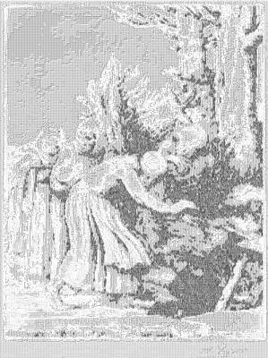

<html>

    
    

# The Triumph of Death: Death Prepares a Dwelling for the Homeless (Le triomphe de la Mort: Lamort a prepare une demeure a des abandonnees)

## Artwork Details

- Date: Unknown
- Category: Print
- Medium: Drypoint on light green paper
- Image rights: Courtesy National Gallery of Art, Washington

Additional details about the artwork can be found [here](https://www.artsy.net/artwork/alphonse-legros-the-triumph-of-death-death-prepares-a-dwelling-for-the-homeless-le-triomphe-de-la-mort-lamort-a-prepare-une-demeure-a-des-abandonnees).

## Contact

Got questions, compliments, or just wanna chat about the latest tech trends? Shoot me an email
at [hellocanardev@gmail.com](mailto:hellocanardev@gmail.com). I promise not to hit you with any spam—just good vibes and
maybe a few lines of code.

</html>
