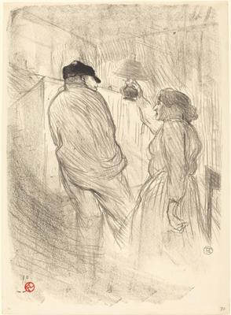
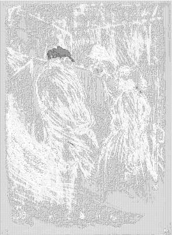

<html>

    
    

# At the Theatre-Libre: Antoine in "L'inquiétude" (Au Théatre-Libre: Antoine dans "L'inquiétude")

## Artwork Details

- Date: 1894
- Category: Print
- Medium: Lithograph in black on velin paper
- Image rights: Courtesy National Gallery of Art, Washington

Additional details about the artwork can be found [here](https://www.artsy.net/artwork/henri-de-toulouse-lautrec-at-the-theatre-libre-antoine-in-linquietude-au-theatre-libre-antoine-dans-linquietude).

## Contact

Got questions, compliments, or just wanna chat about the latest tech trends? Shoot me an email
at [hellocanardev@gmail.com](mailto:hellocanardev@gmail.com). I promise not to hit you with any spam—just good vibes and
maybe a few lines of code.

</html>
